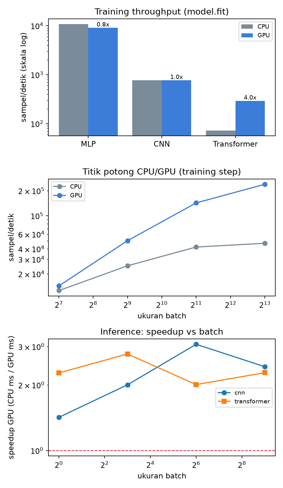

# Ringkasan

Dokumen ini membandingkan CPU dan GPU untuk beban kerja AI pada satu perangkat
nyata: laptop dengan **NVIDIA GeForce RTX 3070 Ti Laptop GPU** dan
**Intel Core i9-12900H** yang dijalankan di WSL2. Semua angka di sini diukur
langsung di mesin tersebut, bukan dikutip dari spesifikasi pabrikan atau dari
benchmark publik. Preset yang dipakai: `standard`.

Tiga temuan utama:

**1. GPU tidak selalu lebih cepat.** GPU baru mulai menang pada ukuran batch **128**. Di bawah itu CPU justru lebih cepat, karena setiap langkah training di GPU membawa biaya tetap (peluncuran kernel, sinkronisasi, dispatch dari Python) yang tidak bergantung pada besar batch.

**2. Selisihnya sangat bergantung jenis operasi.** Pada perkalian matriks fp32 murni, GPU mencapai **4,545 GFLOP/s** melawan **398 GFLOP/s** di CPU — sekitar **11.4x**. Angka ini adalah *plafon*: tidak ada beban kerja nyata dalam laporan ini yang speedup-nya melampauinya. Pada training penuh, perolehan terbesar ada di transformer (**4.0x**), jauh di bawah plafon GEMM tadi.
Jarak antara plafon dan beban kerja nyata itulah inti persoalannya: yang hilang
di antaranya adalah operasi kecil, sinkronisasi, dan lapisan yang tidak menyatu
menjadi satu kernel.

**3. Untuk inference, ukuran batch menentukan segalanya.** Pada batch 1, GPU
sering hanya imbang atau bahkan kalah, karena waktu yang terukur didominasi
latensi peluncuran kernel dan transfer data, bukan komputasi. Keunggulan GPU
muncul saat batch besar, ketika 46 SM benar-benar terisi.

Konsekuensi praktisnya sederhana: **GPU pada perangkat ini adalah mesin
throughput, bukan mesin latensi.** Ia membayar biaya tetap di awal setiap
langkah, lalu mengerjakan pekerjaan besar nyaris gratis. Kalau pekerjaan yang
diberikan kecil, biaya tetap itu yang mendominasi dan CPU menang.

Lingkungan uji: TensorFlow 2.21.0, Keras
3.15.1, 6 thread CPU
terlihat di WSL, TF32 aktif.


# Kenapa benchmark ini bisa dipercaya

Sebagian besar perbandingan CPU-vs-GPU yang beredar salah ukur. Enam hal
berikut adalah yang membedakan angka yang bermakna dari angka yang kebetulan.

**Isolasi device lewat proses terpisah.** TensorFlow menempatkan operasi ke GPU
sejak inisialisasi. Menulis `with tf.device('/CPU:0')` di proses yang sudah
melihat GPU tidak cukup — sebagian op tetap bocor ke GPU dan hasil "CPU" jadi
terlalu bagus. Skrip ini menjalankan sisi CPU sebagai proses anak dengan
`CUDA_VISIBLE_DEVICES=-1`, lalu memeriksa ulang bahwa GPU benar-benar tidak
terlihat sebelum mengukur apa pun.

**Warm-up selalu dibuang.** Iterasi pertama berisi penelusuran (*tracing*)
`tf.function`, autotune algoritma cuDNN, dan alokasi memori pertama. Itu biaya
sekali jalan, bukan biaya komputasi. Memasukkannya ke hasil bisa melipatgandakan
angka GPU secara keliru.

**Sinkronisasi device sebelum timer ditutup.** Ini kesalahan paling umum.
Eksekusi GPU bersifat asinkron: `model(x)` kembali ke Python sebelum kernelnya
selesai. Tanpa sinkronisasi eksplisit, yang terukur adalah kecepatan Python
melempar perintah — biasanya menghasilkan "speedup" 100x yang tidak nyata.
Setiap timer di sini ditutup dengan sinkronisasi device.

**Setiap kasus dijalankan di proses sendiri.** Ini ditemukan secara empiris,
bukan direncanakan. Pada versi pertama skrip ini seluruh kasus berbagi satu
proses, dan CNN — yang berjalan menjelang akhir — melaporkan GPU lebih lambat
daripada CPU. Penyebabnya adalah kondisi yang diwariskan kasus-kasus sebelumnya:
fragmentasi VRAM dan, terutama, GPU yang sudah panas. Setiap kasus kini memakai
prosesnya sendiri.

Isolasi itu mengurangi masalahnya, tetapi jujur saja **tidak menghilangkannya**.
CNN yang sama, diukur pada mesin yang benar-benar dingin, memberi sekitar 1030
sampel/detik di GPU; diukur di tengah rangkaian benchmark — meski di proses
terpisah — sekitar 770. Selisih 30% itu murni termal, dan ini laptop: frekuensi
GPU dan CPU turun saat panas, dan tidak ada yang bisa dilakukan skrip untuk
mencegahnya.

Untuk beban yang pendek dan padat komputasi, efeknya bahkan lebih besar. GEMM
2048x2048 yang dijalankan sendirian pada mesin dingin mencapai sekitar 10.500
GFLOP/s; angka yang sama di tengah rangkaian benchmark turun ke sekitar 4.500 —
lebih dari dua kali lipat selisihnya. Penyebabnya adalah *boost clock*: burst
pendek pada GPU dingin berjalan pada frekuensi yang tidak bisa dipertahankan.

Karena itu, dua aturan membaca laporan ini. **Angka absolut punya ketidakpastian
besar** — anggap ±30% untuk beban panjang, dan bisa 2x untuk burst pendek seperti
GEMM. **Rasio CPU-GPU jauh lebih andal**, karena kedua sisi diukur dalam kondisi
termal yang berdekatan, dan itulah sebabnya laporan ini menekankan rasio.
Untuk angka absolut yang bersih, jalankan satu kasus saja pada mesin dingin.

**Median, bukan rata-rata.** Di WSL, satu iterasi bisa tertunda oleh penjadwal
atau thermal throttling. Rata-rata menyerap pencilan itu; median tidak.

**Data sintetis dengan seed tetap.** Untuk mengukur *waktu*, isi data tidak
berpengaruh — yang penting bentuk tensor dan jumlah operasinya identik di kedua
device. Keuntungannya: tidak ada dependensi unduhan, dan pengukuran bisa diulang
persis. Yang tidak diukur di sini adalah akurasi model; itu memang bukan tujuan
benchmark ini.

**Batas memori dihormati.** Setiap kasus dirancang muat di bawah 4 GB VRAM dari
8 GB yang tersedia, dan di bawah 3 GB RAM. `set_memory_growth` diaktifkan supaya
TensorFlow tidak langsung mencaplok seluruh VRAM — tanpa itu, penggunaan memori
puncak tidak terbaca dan proses lain ikut tercekik.

Satu hal yang **tidak** dikendalikan: perangkat ini laptop. Frekuensi CPU dan GPU
turun saat panas. Jalankan ulang saat mesin dingin bila angka terasa aneh, dan
perhatikan kolom `p90` pada JSON keluaran sebagai indikator kestabilan.


# Delapan kasus uji

Kasus disusun dari yang paling sintetis ke yang paling menyerupai pekerjaan
nyata. Dua kasus pertama menjelaskan *kenapa* kasus berikutnya berperilaku
seperti itu.

**1. GEMM (perkalian matriks).** Matriks $N \times N$ butuh $2N^3$ operasi
titik-mengambang. Ini kasus paling menguntungkan GPU: padat komputasi, pola
akses memori teratur, tanpa cabang. Fungsinya sebagai plafon — batas atas
speedup yang mungkin dicapai pada perangkat ini.

**2. Sapuan ukuran batch.** Satu langkah training MLP diulang pada batch 128
sampai 8192. Ini kasus paling penting dalam dokumen ini, karena ia memisahkan
biaya tetap per langkah dari biaya komputasi yang sebanding dengan beban.

**3. Overhead `model.fit`.** Default Keras adalah `steps_per_execution=1`:
setiap langkah kembali ke Python dan menyinkronkan device untuk mengagregasi
loss. Kasus ini membandingkannya dengan `steps_per_execution=32`, yang
menjalankan 32 langkah dalam satu panggilan graph.

**4. Training MLP.** Jaringan *dense* 1.5 juta parameter. Murni matmul, tanpa
konvolusi, dengan langkah yang pendek — wakil dari model kecil.

**5. Training CNN.** Enam lapis konvolusi pada citra 32x32. Konvolusi adalah
operasi yang paling diuntungkan cuDNN dan Tensor Core; di sinilah selisih
CPU-GPU paling lebar.

**6. Training transformer encoder.** Empat lapis, `d_model` 256, panjang
sekuens 128. Bentuk beban kerjanya sengaja dibuat sama dengan *fine-tuning*
BERT/DeBERTa untuk klasifikasi kalimat, hanya lebih kecil supaya sisi CPU
selesai dalam waktu wajar.

**7. Inference pada beberapa ukuran batch.** Hanya *forward pass*, tanpa
gradien dan tanpa optimizer. Diukur pada batch 1 sampai 512 untuk menemukan
di titik mana GPU mulai unggul.

**8. XLA (`jit_compile=True`).** XLA mengompilasi graph menjadi kernel yang
menyatu. Ia sering direkomendasikan tanpa syarat; kasus ini mengukurnya alih-alih
mempercayainya.

**9. Mixed precision bf16.** Compute capability 8.6 punya Tensor Core bf16.
Kasus ini mengukur perolehannya terhadap fp32 pada CNN dan transformer.
Hanya dijalankan di GPU: di CPU, bf16 diemulasi dan justru lebih lambat,
sehingga perbandingannya tidak bermakna.


# Hasil pengukuran



## GEMM fp32 (GFLOP/s)

| Ukuran | CPU | GPU | Speedup |
|---|---|---|---|
| 1024x1024 | 241 | 1,489 | 6.2x |
| 2048x2048 | 370 | 4,545 | 12.3x |
| 4096x4096 | 398 | 3,647 | 9.2x |


Speedup naik seiring ukuran matriks. Pada matriks kecil, GPU belum terisi penuh dan biaya peluncuran kernel masih terasa; pada matriks besar barulah throughput aritmetikanya terlihat utuh. Pola ini akan berulang di setiap kasus berikutnya.


## Titik potong: throughput vs ukuran batch

| Batch | CPU ms | GPU ms | CPU spl/s | GPU spl/s | Speedup |
|---|---|---|---|---|---|
| 128 | 10.2 | 8.9 | 12,581 | 14,308 | 1.1x |
| 512 | 20.5 | 10.2 | 24,998 | 50,109 | 2.0x |
| 2048 | 48.7 | 14.3 | 42,046 | 142,721 | 3.4x |
| 8192 | 175.5 | 34.2 | 46,665 | 239,266 | 5.1x |


Perhatikan kolom milidetik, bukan kolom speedup. Waktu per langkah di CPU naik hampir sebanding dengan besar batch — itu komputasi nyata. Di GPU, waktu per langkah nyaris tidak bergerak pada batch kecil (8.9 ms pada batch 128) lalu baru naik pada batch besar. Bagian yang datar itulah biaya tetap: sekitar 9 ms yang dibayar setiap langkah terlepas dari berapa banyak pekerjaan yang diberikan.

Di mesin ini biaya tetap tersebut besar karena WSL hanya memaparkan 3 core. Host-lah yang menyusun dan meluncurkan kernel; dengan CPU sesempit itu, GPU sering menganggur menunggu diberi pekerjaan. Implikasi praktisnya: **perbesar batch sampai VRAM hampir penuh.** Pada perangkat 8 GB ini, batch yang terlalu kecil membuang kapasitas GPU secara percuma.


## Overhead `model.fit` (sampel/detik)

| steps_per_execution | CPU | GPU | GPU/CPU |
|---|---|---|---|
| 1 | 10,638 | 9,473 | 0.9x |
| 32 | 12,890 | 16,286 | 1.3x |


Menaikkan `steps_per_execution` dari 1 ke 32 memberi **1.7x** di GPU tanpa mengubah model, data, atau hyperparameter apa pun — cukup satu argumen tambahan pada `model.compile`. Perolehan ini datang dari menghilangkan perjalanan bolak-balik Python dan sinkronisasi device di setiap langkah. Semakin kecil modelnya, semakin besar perolehannya. Di CPU efeknya kecil, karena di sana tidak ada sinkronisasi device yang perlu diamortisasi.


## Training penuh (`model.fit`, detik per epoch)

| Model | Param | CPU s/ep | GPU s/ep | Speedup |
|---|---|---|---|---|
| MLP | 1.5M | 5.6 | 6.6 | 0.8x |
| CNN | 0.3M | 13.0 | 13.0 | 1.0x |
| Transformer | 8.3M | 55.0 | 13.7 | 4.0x |


Urutan perolehan GPU pada pengukuran ini: Transformer (4.0x), CNN (1.0x), MLP (0.8x).

Mekanismenya sama di ketiganya, hanya bobotnya berbeda. Yang menentukan adalah berapa banyak pekerjaan aritmetika yang dikerjakan per peluncuran kernel. Transformer memberi paling banyak: *attention* dan lapisan *feed-forward* adalah matmul besar, dan model ini yang terbesar parameternya. MLP memberi paling sedikit: langkahnya terlalu pendek, sehingga biaya tetap per langkah menelan sebagian besar waktunya. CNN berada di antaranya, dan hasilnya lebih rendah dari yang biasa diperkirakan orang untuk konvolusi — sebabnya ada pada `BatchNormalization`.

Pengukuran terpisah pada satu langkah training CNN menunjukkan lapisan normalisasi itu sendiri menyumbang sekitar 51 ms dari 90 ms per langkah di GPU. Di backend TensorFlow, `BatchNormalization` Keras 3 tidak dipetakan ke kernel cuDNN yang menyatu; ia tersusun dari banyak operasi kecil, dan setiap operasi kecil membayar ongkos peluncuran. Dengan 3 core di WSL yang harus menyusun peluncuran itu, ongkosnya membengkak. Ini kembali ke tema yang sama: pada perangkat ini, yang membatasi sering kali bukan GPU-nya, melainkan host yang memberinya makan.

Angka pada tabel ini memakai `steps_per_execution=1`, default Keras, sehingga mewakili apa yang dialami pengguna apa adanya — bukan hasil yang sudah disetel.


## XLA `jit_compile` pada CNN (sampel/detik)

| XLA | CPU | GPU | GPU/CPU |
|---|---|---|---|
| nonaktif | 760 | 1,089 | 1.4x |
| aktif | 463 | 743 | 1.6x |


Pada model dan perangkat ini, mengaktifkan XLA **justru memperlambat** training GPU (1,089 menjadi 743 sampel/detik, 0.7x). Hasil ini layak digarisbawahi karena bertentangan dengan saran yang umum beredar. XLA menyatukan operasi-operasi kecil — yang mestinya menolong, mengingat diagnosis di atas — tetapi ia juga menggantikan pemilihan algoritma konvolusi milik cuDNN dengan pilihannya sendiri, dan untuk konvolusi 3x3 pada citra kecil pilihan itu bisa lebih buruk. Ditambah waktu kompilasi yang harus dibayar di awal.

Kesimpulannya bukan "jangan pakai XLA", melainkan **ukur XLA pada model Anda sendiri sebelum memakainya.** Ia bisa memberi perolehan besar pada model yang didominasi operasi *pointwise*, dan kerugian seperti di sini pada model yang didominasi konvolusi.


## Inference: latensi vs throughput


**cnn** (ms per batch, dan sampel/detik)

| Batch | CPU ms | GPU ms | CPU spl/s | GPU spl/s | Speedup |
|---|---|---|---|---|---|
| 1 | 3.97 | 2.80 | 252 | 358 | 1.4x |
| 8 | 7.73 | 3.85 | 1,035 | 2,076 | 2.0x |
| 64 | 22.01 | 7.15 | 2,908 | 8,946 | 3.1x |
| 512 | 139.83 | 57.60 | 3,662 | 8,889 | 2.4x |


**transformer** (ms per batch, dan sampel/detik)

| Batch | CPU ms | GPU ms | CPU spl/s | GPU spl/s | Speedup |
|---|---|---|---|---|---|
| 1 | 17.29 | 7.61 | 58 | 132 | 2.3x |
| 8 | 55.23 | 19.89 | 145 | 402 | 2.8x |
| 64 | 280.71 | 139.67 | 228 | 458 | 2.0x |
| 512 | 2255.19 | 989.40 | 227 | 518 | 2.3x |


Dua kolom terakhir menceritakan hal yang berbeda, dan keduanya penting.

Kolom milidetik adalah **latensi**: berapa lama satu permintaan ditunggu. Pada batch 1, GPU nyaris tidak memberi keuntungan — pekerjaannya terlalu sedikit untuk menutupi ongkos mengirim data ke VRAM, meluncurkan kernel, dan menarik hasilnya kembali. Untuk layanan yang melayani satu permintaan pada satu waktu dengan target latensi ketat, CPU sering merupakan pilihan yang benar, dan sekaligus lebih murah dan lebih sederhana untuk dioperasikan.

Kolom sampel/detik adalah **throughput**: berapa banyak yang selesai per satuan waktu. Di sini GPU menang telak pada batch besar. Untuk pekerjaan *batch* — memberi label satu korpus, mengekstrak *embedding*, mengevaluasi himpunan uji — GPU jelas alat yang tepat.

Aturan praktisnya: kalau permintaan datang satu per satu dan pengguna menunggu, ukur latensi. Kalau pekerjaan bisa dikumpulkan dulu, ukur throughput dan perbesar batch.


## Mixed precision bf16 (GPU saja, sampel/detik)

| Model | fp32 | bf16 | Speedup | VRAM puncak fp32/bf16 (MB) |
|---|---|---|---|---|
| cnn | 768 | 639 | 0.8x | 390.7 / 306.2 |
| transformer | 293 | 491 | 1.7x | 497.3 / 402.1 |


bf16 punya rentang eksponen yang sama dengan fp32, hanya mantisanya lebih pendek. Karena itu ia tidak memerlukan *loss scaling* seperti fp16, dan pada Ampere praktis selalu layak dipakai untuk training. Perolehan kecepatannya nyata tetapi biasanya lebih sederhana daripada yang dijanjikan angka Tensor Core — sebab sebagian beban kerja terbatas oleh bandwidth memori, bukan aritmetika. Penghematan VRAM-nya sering justru lebih berharga daripada kecepatannya: pada perangkat 8 GB, VRAM yang bebas bisa ditukar dengan batch yang lebih besar, dan batch lebih besar itulah yang mengembalikan kecepatan.


## Tabel gabungan

| Kasus | Konfigurasi | Satuan | CPU | GPU | Speedup |
|---|---|---|---|---|---|
| GEMM | 1024x1024 fp32 | GFLOP/s | 241.4 | 1488.9 | 6.2x |
| GEMM | 2048x2048 fp32 | GFLOP/s | 370.5 | 4545.2 | 12.3x |
| GEMM | 4096x4096 fp32 | GFLOP/s | 398.0 | 3646.6 | 9.2x |
| Skala batch (MLP) | batch 128 | sampel/s | 12581 | 14308 | 1.1x |
| Skala batch (MLP) | batch 512 | sampel/s | 24998 | 50109 | 2.0x |
| Skala batch (MLP) | batch 2048 | sampel/s | 42046 | 142721 | 3.4x |
| Skala batch (MLP) | batch 8192 | sampel/s | 46665 | 239266 | 5.1x |
| Overhead fit | steps_per_execution=1 | sampel/s | 10638 | 9473 | 0.9x |
| Overhead fit | steps_per_execution=32 | sampel/s | 12890 | 16286 | 1.3x |
| XLA (CNN) | jit_compile=False | sampel/s | 760 | 1089 | 1.4x |
| XLA (CNN) | jit_compile=True | sampel/s | 463 | 743 | 1.6x |
| Training MLP | batch 128, 1.5M param | sampel/s | 10752.1 | 9056.5 | 0.8x |
| Training CNN | batch 128, 0.3M param | sampel/s | 768.7 | 768.5 | 1.0x |
| Training Transformer | batch 32, 8.3M param | sampel/s | 72.7 | 292.9 | 4.0x |
| Inference cnn | batch 1 | ms/batch | 3.974 | 2.796 | 1.4x |
| Inference cnn | batch 8 | ms/batch | 7.727 | 3.854 | 2.0x |
| Inference cnn | batch 64 | ms/batch | 22.009 | 7.154 | 3.1x |
| Inference cnn | batch 512 | ms/batch | 139.828 | 57.600 | 2.4x |
| Inference transformer | batch 1 | ms/batch | 17.288 | 7.607 | 2.3x |
| Inference transformer | batch 8 | ms/batch | 55.231 | 19.885 | 2.8x |
| Inference transformer | batch 64 | ms/batch | 280.711 | 139.671 | 2.0x |
| Inference transformer | batch 512 | ms/batch | 2255.188 | 989.401 | 2.3x |
| bf16 vs fp32 (cnn) | GPU saja | sampel/s | 768.5 (fp32) | 638.7 (bf16) | 0.8x |
| bf16 vs fp32 (transformer) | GPU saja | sampel/s | 292.9 (fp32) | 490.9 (bf16) | 1.7x |


# Kapan memakai CPU, kapan GPU

Hasil di atas bisa diringkas menjadi keputusan yang cukup jelas.

**Pakai GPU untuk:** training model apa pun yang punya konvolusi atau
*attention*; training apa pun yang berjalan lebih dari beberapa menit; inference
*batch* atas banyak data; dan setiap eksperimen yang ingin Anda ulang beberapa
kali dengan seed berbeda. Di kategori ini selisihnya bukan soal persentase,
melainkan soal apakah eksperimennya selesai hari ini atau minggu depan.

**Pakai CPU untuk:** inference satu-per-satu dengan target latensi ketat; model
klasik (SVM, gradient boosting, regresi logistik) yang memang tidak dirancang
untuk GPU; prapemrosesan dan tokenisasi; dan pengembangan awal ketika Anda hanya
ingin tahu apakah kodenya jalan. Memindahkan model 200 MB ke VRAM untuk
mengklasifikasi satu kalimat adalah kerugian bersih.

**Yang perlu diwaspadai** adalah wilayah abu-abu di bawah batch 128. Di sana GPU
sedang menganggur menunggu diberi pekerjaan, dan menambah GPU tidak akan
menyelesaikan apa pun. Kalau training Anda terasa lambat di wilayah ini,
urutan perbaikannya:

1. **Perbesar batch** sampai VRAM hampir penuh. Ini pengungkit terbesar dan
   paling murah.
2. **Naikkan `steps_per_execution`** pada `model.compile`, misalnya ke 32.
   Satu argumen, tanpa risiko terhadap hasil.
3. **Aktifkan mixed precision bf16** dengan
   `keras.mixed_precision.set_global_policy("mixed_bfloat16")`. Aman di Ampere,
   dan VRAM yang dihemat bisa ditukar dengan batch yang lebih besar lagi.
4. **Periksa pipeline data.** Dengan 3 core di WSL, pemuatan dan augmentasi data
   gampang menjadi hambatan sesungguhnya. Gunakan `tf.data` dengan `.cache()`
   dan `.prefetch(tf.data.AUTOTUNE)`, dan jaga jumlah worker di kisaran 2-4.
5. **Baru setelah itu** pertimbangkan `jit_compile=True` (XLA). Ia bisa
   membantu banyak, tetapi juga bisa memperpanjang waktu kompilasi dan
   sesekali gagal pada model dinamis — jadi ukur, jangan asumsikan.

Satu catatan tentang perangkat ini secara khusus: **8 GB VRAM adalah batasan
yang mengikat, dan 3 core CPU di WSL adalah batasan kedua yang sering
terlupakan.** Yang pertama membatasi seberapa besar model yang muat; yang kedua
membatasi seberapa cepat Anda bisa memberinya makan. Menaikkan alokasi memori
WSL lewat `%UserProfile%\.wslconfig` (`memory=24GB`, dan `processors=8` bila
tersedia) sering memberi perbaikan yang lebih besar daripada tuning model.


# Kaitan dengan rencana riset

Bila arah pemakaiannya adalah *fine-tuning* encoder untuk klasifikasi ambiguitas
persyaratan — DeBERTa-v3-base atau IndoBERT pada kalimat pendek — hasil di atas
memberi beberapa konsekuensi langsung.

Kasus transformer dalam laporan ini adalah versi mininya: encoder-only, sekuens
128 token, hanya lebih kecil dari model 183 juta parameter yang sesungguhnya.
Rasio CPU-GPU yang terukur di sini akan bertahan dan bahkan melebar untuk model
yang lebih besar, karena model besar memberi lebih banyak pekerjaan per langkah
sehingga biaya tetap semakin tidak relevan.

Dalam praktiknya: dengan `max_length=128` dan batch 32 dalam bf16, DeBERTa-v3-base
memakai sekitar 2-4 GB VRAM dan satu putaran *fine-tuning* penuh selesai dalam
hitungan menit. Itu artinya validasi silang 5-lipat dengan beberapa seed sangat
terjangkau di perangkat ini — dan untuk kumpulan data ambiguitas yang biasanya
hanya beberapa ratus sampai beberapa ribu kalimat, pengulangan itu jauh lebih
menentukan kekuatan klaim Anda daripada memilih model yang lebih besar.

Tiga hal yang perlu diantisipasi:

Pertama, **dataset kecil membuat langkah training pendek**, dan langkah pendek
adalah wilayah tempat GPU paling tidak efisien. Perbesar batch dan naikkan
`steps_per_execution`; jangan menyimpulkan bahwa GPU-nya bermasalah.

Kedua, **tokenisasi berjalan di CPU**, dan CPU Anda hanya 3 core di WSL. Lakukan
tokenisasi sekali di awal lalu simpan hasilnya, jangan mengulanginya setiap
epoch.

Ketiga, **untuk inference saat demo atau saat menyajikan model**, ukur latensi
batch 1 seperti pada kasus 7 sebelum berasumsi bahwa GPU diperlukan. Untuk
mengklasifikasi satu kalimat persyaratan, CPU kemungkinan besar sudah cukup, dan
itu menyederhanakan penyajiannya secara signifikan.


# Cara menjalankan ulang

```bash
# semua kasus, kedua device (perlu belasan menit)
python cpu_vs_gpu.py --preset standard --report results

# versi cepat untuk memastikan semuanya jalan
python cpu_vs_gpu.py --preset quick

# hanya kasus tertentu
python cpu_vs_gpu.py --only gemm,scaling,inference

# bangun ulang PDF ini dari hasil terbaru
python make_report.py
```

Keluarannya: `results/cpu.json`, `results/gpu.json`, `results/summary.json`
(berisi seluruh angka mentah termasuk min dan p90 untuk memeriksa kestabilan),
serta `results/cpu_vs_gpu.png`.

Bila hasil Anda berbeda jauh dari laporan ini, periksa dulu: apakah mesin sedang
panas, apakah ada proses lain memakai GPU (`nvidia-smi`), dan berapa banyak RAM
yang tersisa di WSL (`free -h`). Ketiganya bisa menggeser angka secara
substansial.

# Lampiran: kode lengkap

Berkas `cpu_vs_gpu.py`, ditulis dengan Keras 3 di atas backend TensorFlow.

```python
"""
Benchmark CPU vs GPU (CUDA) untuk beban kerja AI: training dan inference.
Ditulis dengan Keras 3 (backend TensorFlow).

Disesuaikan untuk perangkat pada check_gpu/gpu_spec.md:
  GPU : RTX 3070 Ti Laptop, 8 GB VRAM, compute 8.6 (Ampere) -> bf16 + TF32, tanpa FP8
  CPU : i9-12900H, hanya 6 logical / 3 core yang terlihat di WSL
  RAM : 19 GiB total (~6 GiB bebas), swap 8 GiB
Semua kasus uji dibatasi agar muat di <4 GB VRAM dan <3 GB RAM, sehingga sisi CPU
tetap selesai dalam waktu yang wajar meski hanya punya 3 core.

Cara pakai
----------
    python cpu_vs_gpu.py                      # jalankan semua kasus di CPU lalu GPU
    python cpu_vs_gpu.py --preset quick       # versi cepat (~2-3 menit)
    python cpu_vs_gpu.py --preset full        # versi panjang, angka paling stabil
    python cpu_vs_gpu.py --only gemm,cnn      # pilih kasus tertentu
    python cpu_vs_gpu.py --device gpu         # satu device saja
    python cpu_vs_gpu.py --report hasil/      # tulis JSON + PNG ke folder lain

Catatan metodologi (ini yang membuat angkanya layak dikutip)
------------------------------------------------------------
1. CPU dan GPU dijalankan di *proses terpisah*. TensorFlow menempatkan op ke GPU
   sejak inisialisasi, jadi `with tf.device('/CPU:0')` di proses yang sama masih
   bocor ke GPU. Proses anak untuk CPU dijalankan dengan CUDA_VISIBLE_DEVICES=-1.
2. Setiap pengukuran didahului warm-up yang dibuang: iterasi pertama berisi
   tracing tf.function, autotune cuDNN, dan alokasi memori -- bukan biaya komputasi.
3. Eksekusi GPU bersifat asinkron. Timer selalu ditutup dengan sinkronisasi device
   eksplisit, kalau tidak yang terukur hanyalah kecepatan Python melempar kernel.
4. Yang dilaporkan adalah median, bukan rata-rata: satu iterasi yang kena thermal
   throttling atau scheduler WSL tidak boleh menggeser hasil.
5. Data dibangkitkan secara sintetis dengan seed tetap. Untuk mengukur *waktu*,
   isi data tidak berpengaruh -- yang penting bentuk tensor dan jumlah operasinya
   identik di kedua device, dan tidak ada dependensi unduhan dataset.
"""

from __future__ import annotations

import argparse
import json
import os
import platform
import statistics
import subprocess
import sys
import time
from pathlib import Path

# ---------------------------------------------------------------------------
# Preset ukuran beban kerja
# ---------------------------------------------------------------------------

PRESETS = {
    "quick": {
        "gemm_sizes": [1024, 2048],
        "gemm_iters": 10,
        "mlp_samples": 20_000,
        "mlp_epochs": 2,
        "cnn_samples": 5_000,
        "cnn_epochs": 1,
        "trf_samples": 2_000,
        "trf_epochs": 1,
        "infer_batches": [1, 32, 256],
        "infer_iters": 30,
        "scaling_batches": [128, 1024, 4096],
    },
    "standard": {
        "gemm_sizes": [1024, 2048, 4096],
        "gemm_iters": 20,
        "mlp_samples": 60_000,
        "mlp_epochs": 3,
        "cnn_samples": 10_000,
        "cnn_epochs": 2,
        "trf_samples": 4_000,
        "trf_epochs": 1,
        "infer_batches": [1, 8, 64, 512],
        "infer_iters": 50,
        "scaling_batches": [128, 512, 2048, 8192],
    },
    "full": {
        "gemm_sizes": [1024, 2048, 4096, 8192],
        "gemm_iters": 30,
        "mlp_samples": 60_000,
        "mlp_epochs": 5,
        "cnn_samples": 20_000,
        "cnn_epochs": 3,
        "trf_samples": 8_000,
        "trf_epochs": 2,
        "infer_batches": [1, 8, 64, 512, 1024],
        "infer_iters": 100,
        "scaling_batches": [128, 512, 2048, 8192, 16384],
    },
}

ALL_CASES = ["gemm", "scaling", "overhead", "xla", "mlp", "cnn", "transformer",
             "inference", "bf16"]

SEED = 1337
MLP_BATCH = 128
CNN_BATCH = 128
TRF_BATCH = 32

# Hyperparameter transformer encoder kecil -- sengaja dibuat mirip bentuk beban
# kerja klasifikasi kalimat (seq pendek, encoder-only), bukan LLM generatif.
TRF_VOCAB = 20_000
TRF_SEQLEN = 128
TRF_DMODEL = 256
TRF_HEADS = 4
TRF_LAYERS = 4
TRF_FF = 1024
N_CLASSES = 10


# ---------------------------------------------------------------------------
# Utilitas timing
# ---------------------------------------------------------------------------

def sync_device():
    """Blokir sampai semua kernel yang antre di device selesai.

    Wajib sebelum menutup timer: eksekusi GPU asinkron, tanpa ini yang terukur
    adalah waktu enqueue, bukan waktu komputasi.
    """
    import tensorflow as tf

    if hasattr(tf.test.experimental, "sync_devices"):
        tf.test.experimental.sync_devices()
    else:  # fallback: paksa transfer device->host
        tf.constant(0.0).numpy()


def timed_median(fn, iters, warmup=3):
    """Jalankan fn() beberapa kali, buang warm-up, kembalikan statistik detik."""
    for _ in range(warmup):
        fn()
    sync_device()

    samples = []
    for _ in range(iters):
        t0 = time.perf_counter()
        fn()
        sync_device()
        samples.append(time.perf_counter() - t0)

    samples.sort()
    return {
        "median_s": statistics.median(samples),
        "min_s": samples[0],
        "p90_s": samples[min(len(samples) - 1, int(0.9 * len(samples)))],
        "iters": iters,
    }


def peak_vram_mb():
    import tensorflow as tf

    try:
        info = tf.config.experimental.get_memory_info("GPU:0")
        return round(info["peak"] / 1024**2, 1)
    except Exception:
        return None


def reset_vram_stats():
    import tensorflow as tf

    try:
        tf.config.experimental.reset_memory_stats("GPU:0")
    except Exception:
        pass


# ---------------------------------------------------------------------------
# Data sintetis
# ---------------------------------------------------------------------------

def make_tabular(n, dim):
    import numpy as np

    rng = np.random.default_rng(SEED)
    x = rng.standard_normal((n, dim), dtype=np.float32)
    y = rng.integers(0, N_CLASSES, size=n).astype("int32")
    return x, y


def make_images(n):
    import numpy as np

    rng = np.random.default_rng(SEED)
    x = rng.random((n, 32, 32, 3), dtype=np.float32)
    y = rng.integers(0, N_CLASSES, size=n).astype("int32")
    return x, y


def make_tokens(n):
    import numpy as np

    rng = np.random.default_rng(SEED)
    x = rng.integers(0, TRF_VOCAB, size=(n, TRF_SEQLEN)).astype("int32")
    y = rng.integers(0, N_CLASSES, size=n).astype("int32")
    return x, y


# ---------------------------------------------------------------------------
# Model
# ---------------------------------------------------------------------------

def build_mlp():
    import keras

    return keras.Sequential(
        [
            keras.Input(shape=(784,)),
            keras.layers.Dense(1024, activation="relu"),
            keras.layers.Dense(512, activation="relu"),
            keras.layers.Dense(256, activation="relu"),
            keras.layers.Dense(N_CLASSES, activation="softmax", dtype="float32"),
        ],
        name="mlp",
    )


def build_cnn():
    import keras

    L = keras.layers

    def block(x, filters):
        for _ in range(2):
            x = L.Conv2D(filters, 3, padding="same", use_bias=False)(x)
            x = L.BatchNormalization()(x)
            x = L.Activation("relu")(x)
        return L.MaxPooling2D()(x)

    inp = keras.Input(shape=(32, 32, 3))
    x = block(inp, 32)
    x = block(x, 64)
    x = block(x, 128)
    x = L.GlobalAveragePooling2D()(x)
    x = L.Dense(256, activation="relu")(x)
    out = L.Dense(N_CLASSES, activation="softmax", dtype="float32")(x)
    return keras.Model(inp, out, name="cnn")


def build_transformer():
    import keras
    import tensorflow as tf

    L = keras.layers
    inp = keras.Input(shape=(TRF_SEQLEN,), dtype="int32")

    tok = L.Embedding(TRF_VOCAB, TRF_DMODEL)(inp)
    pos = L.Embedding(TRF_SEQLEN, TRF_DMODEL)(tf.range(TRF_SEQLEN))
    x = tok + pos

    for _ in range(TRF_LAYERS):
        attn = L.MultiHeadAttention(num_heads=TRF_HEADS, key_dim=TRF_DMODEL // TRF_HEADS)(x, x)
        x = L.LayerNormalization(epsilon=1e-6)(x + attn)
        ff = L.Dense(TRF_FF, activation="gelu")(x)
        ff = L.Dense(TRF_DMODEL)(ff)
        x = L.LayerNormalization(epsilon=1e-6)(x + ff)

    x = L.GlobalAveragePooling1D()(x)
    out = L.Dense(N_CLASSES, activation="softmax", dtype="float32")(x)
    return keras.Model(inp, out, name="transformer_encoder")


def compile_model(model, steps_per_execution=1):
    """steps_per_execution=1 adalah default Keras: setiap step kembali ke Python
    dan menyinkronkan device. Menaikkannya mengamortisasi overhead itu -- lihat
    kasus `overhead`."""
    model.compile(
        optimizer="adam",
        loss="sparse_categorical_crossentropy",
        metrics=[],
        steps_per_execution=steps_per_execution,
    )
    return model


# ---------------------------------------------------------------------------
# Kasus uji
# ---------------------------------------------------------------------------

def case_gemm(cfg, log):
    """Microbenchmark GEMM: batas atas throughput aritmetika device.

    Perkalian matriks N x N butuh 2*N^3 FLOP. Ini kasus paling menguntungkan GPU
    (compute-bound, akses memori teratur) sehingga berguna sebagai plafon: tidak
    ada beban kerja nyata yang speedup-nya melebihi angka di sini.
    """
    import tensorflow as tf

    results = []
    for n in cfg["gemm_sizes"]:
        a = tf.random.normal((n, n), dtype=tf.float32)
        b = tf.random.normal((n, n), dtype=tf.float32)

        @tf.function(reduce_retracing=True)
        def step():
            return tf.matmul(a, b)

        iters = max(3, cfg["gemm_iters"] // (1 + n // 2048))
        stat = timed_median(step, iters, warmup=2)
        gflops = (2.0 * n**3) / stat["median_s"] / 1e9
        log(f"  GEMM {n}x{n}: {stat['median_s']*1e3:8.2f} ms   {gflops:8.1f} GFLOP/s")
        results.append({"n": n, "gflops": round(gflops, 1), **stat})

        del a, b

    return {"case": "gemm", "unit": "GFLOP/s", "runs": results}


def _train_case(name, model, x, y, batch, epochs, log):
    """Ukur waktu training per epoch dengan model.fit.

    Satu epoch warm-up dijalankan pada potongan kecil terlebih dahulu supaya biaya
    tracing graph dan autotune cuDNN tidak masuk ke hasil.
    """
    reset_vram_stats()
    model.fit(x[: batch * 3], y[: batch * 3], batch_size=batch, epochs=1, verbose=0)
    sync_device()

    t0 = time.perf_counter()
    model.fit(x, y, batch_size=batch, epochs=epochs, verbose=0, shuffle=False)
    sync_device()
    total = time.perf_counter() - t0

    per_epoch = total / epochs
    samples_s = len(x) / per_epoch
    steps = -(-len(x) // batch)
    log(
        f"  {name}: {per_epoch:7.2f} s/epoch   {samples_s:9.1f} sampel/s   "
        f"{per_epoch / steps * 1e3:7.2f} ms/step"
    )
    return {
        "case": name,
        "unit": "sampel/s",
        "params": int(model.count_params()),
        "samples": len(x),
        "batch": batch,
        "epochs": epochs,
        "s_per_epoch": round(per_epoch, 3),
        "samples_per_s": round(samples_s, 1),
        "ms_per_step": round(per_epoch / steps * 1e3, 3),
        "peak_vram_mb": peak_vram_mb(),
    }


def case_scaling(cfg, log):
    """Sapuan ukuran batch pada satu langkah training MLP (tf.function murni).

    Ini kasus paling penting untuk perangkat ini. GPU punya biaya tetap per step
    -- peluncuran kernel, sinkronisasi, dan dispatch dari Python -- yang di WSL
    dengan 3 core terasa besar. Biaya itu tidak bergantung ukuran batch, sedangkan
    waktu komputasi CPU naik linear. Jadi ada titik potong: di bawahnya GPU kalah,
    di atasnya GPU menang, dan jaraknya melebar terus. Grafik dari kasus ini
    menjawab pertanyaan "kenapa GPU saya tidak terasa lebih cepat?".
    """
    import keras
    import tensorflow as tf

    model = build_mlp()
    optimizer = keras.optimizers.Adam()
    loss_fn = keras.losses.SparseCategoricalCrossentropy()

    @tf.function(reduce_retracing=True)
    def train_step(xb, yb):
        with tf.GradientTape() as tape:
            loss = loss_fn(yb, model(xb, training=True))
        grads = tape.gradient(loss, model.trainable_variables)
        optimizer.apply_gradients(zip(grads, model.trainable_variables))
        return loss

    runs = []
    for b in cfg["scaling_batches"]:
        xb, yb = make_tabular(b, 784)
        xb, yb = tf.constant(xb), tf.constant(yb)
        reset_vram_stats()
        iters = max(5, cfg["gemm_iters"])
        stat = timed_median(lambda a=xb, c=yb: train_step(a, c), iters, warmup=5)
        ms = stat["median_s"] * 1e3
        log(f"  batch={b:<6d} {ms:8.3f} ms/step   {b / stat['median_s']:10.0f} sampel/s")
        runs.append({
            "batch": b,
            "ms_per_step": round(ms, 4),
            "samples_per_s": round(b / stat["median_s"], 1),
            "peak_vram_mb": peak_vram_mb(),
        })
        del xb, yb

    return {"case": "scaling", "unit": "sampel/s", "params": int(model.count_params()),
            "runs": runs}


def case_overhead(cfg, log):
    """Efek `steps_per_execution` pada model.fit.

    Default Keras adalah 1: tiap step kembali ke Python dan menyinkronkan device
    untuk agregasi loss. Pada GPU ongkos itu bisa melebihi komputasinya sendiri.
    Menaikkan ke 32 membuat 32 step dijalankan dalam satu panggilan graph.
    Ini optimasi satu baris yang sering terlewat.
    """
    x, y = make_tabular(cfg["mlp_samples"], 784)
    runs = []
    for spe in (1, 32):
        model = compile_model(build_mlp(), steps_per_execution=spe)
        r = _train_case(f"mlp_fit_spe{spe}", model, x, y, MLP_BATCH, cfg["mlp_epochs"], log)
        r["steps_per_execution"] = spe
        runs.append(r)
        del model
    return {"case": "overhead", "unit": "sampel/s", "runs": runs}


def case_xla(cfg, log):
    """Efek jit_compile=True (XLA) pada training CNN.

    XLA sering direkomendasikan begitu saja. Kasus ini mengukurnya alih-alih
    mengasumsikannya: XLA mengompilasi ulang graph menjadi kernel yang menyatu,
    yang menolong bila beban kerja didominasi banyak op kecil, tetapi menambah
    waktu kompilasi dan bisa memilih kernel konvolusi yang lebih lambat daripada
    pilihan cuDNN. Hasilnya perlu diverifikasi per model dan per perangkat.
    """
    x, y = make_images(cfg["cnn_samples"])
    runs = []
    for jit in (False, True):
        model = build_cnn()
        model.compile(optimizer="adam", loss="sparse_categorical_crossentropy",
                      metrics=[], steps_per_execution=32, jit_compile=jit)
        r = _train_case(f"cnn_fit_xla{int(jit)}", model, x, y, CNN_BATCH,
                        cfg["cnn_epochs"], log)
        r["jit_compile"] = jit
        runs.append(r)
        del model
    return {"case": "xla", "unit": "sampel/s", "runs": runs}


def case_mlp(cfg, log):
    """Training MLP dense. Kecil, murni matmul, tanpa conv -- speedup GPU nyata
    tapi moderat karena tiap step terlalu pendek untuk menutupi overhead launch."""
    x, y = make_tabular(cfg["mlp_samples"], 784)
    model = compile_model(build_mlp())
    return _train_case("mlp_train", model, x, y, MLP_BATCH, cfg["mlp_epochs"], log)


def case_cnn(cfg, log):
    """Training CNN pada citra 32x32. Konvolusi adalah beban kerja yang paling
    diuntungkan cuDNN + Tensor Core; di sinilah selisih CPU-GPU paling ekstrem."""
    x, y = make_images(cfg["cnn_samples"])
    model = compile_model(build_cnn())
    return _train_case("cnn_train", model, x, y, CNN_BATCH, cfg["cnn_epochs"], log)


def case_transformer(cfg, log):
    """Training encoder transformer kecil (seq 128). Bentuk beban kerjanya sama
    dengan fine-tuning BERT/DeBERTa untuk klasifikasi kalimat, hanya lebih kecil."""
    x, y = make_tokens(cfg["trf_samples"])
    model = compile_model(build_transformer())
    return _train_case("transformer_train", model, x, y, TRF_BATCH, cfg["trf_epochs"], log)


def case_inference(cfg, log):
    """Inference murni (forward pass) pada beberapa ukuran batch.

    Ini kasus yang paling sering disalahpahami. Pada batch 1 GPU sering kalah atau
    hanya imbang: waktunya didominasi latensi peluncuran kernel dan transfer
    host<->device, bukan komputasi. Keunggulan GPU baru muncul saat batch besar,
    ketika 46 SM benar-benar terisi penuh.
    """
    import tensorflow as tf

    out = {"case": "inference", "unit": "ms/batch", "models": {}}

    for label, builder, maker in (
        ("cnn", build_cnn, make_images),
        ("transformer", build_transformer, make_tokens),
    ):
        model = builder()
        max_b = max(cfg["infer_batches"])
        x, _ = maker(max_b)

        @tf.function(reduce_retracing=True)
        def forward(batch):
            return model(batch, training=False)

        runs = []
        for b in cfg["infer_batches"]:
            xb = tf.constant(x[:b])
            reset_vram_stats()
            stat = timed_median(lambda: forward(xb), cfg["infer_iters"], warmup=5)
            lat_ms = stat["median_s"] * 1e3
            thr = b / stat["median_s"]
            log(
                f"  {label} infer batch={b:<5d} {lat_ms:8.3f} ms/batch   "
                f"{thr:10.1f} sampel/s"
            )
            runs.append(
                {
                    "batch": b,
                    "latency_ms": round(lat_ms, 4),
                    "throughput_samples_s": round(thr, 1),
                    "peak_vram_mb": peak_vram_mb(),
                }
            )
            del xb

        out["models"][label] = {"params": int(model.count_params()), "runs": runs}
        del model, x

    return out


def case_bf16(cfg, log, on_gpu):
    """Training CNN + transformer dengan mixed precision bf16.

    Hanya bermakna di GPU: compute 8.6 punya Tensor Core bf16. Di CPU bf16
    diemulasikan dan justru lebih lambat, jadi kasus ini dilewati di sisi CPU.
    Dibandingkan terhadap hasil fp32 dari kasus cnn/transformer.
    """
    if not on_gpu:
        log("  dilewati: bf16 hanya diukur di GPU (di CPU bf16 diemulasi, bukan dipercepat)")
        return {"case": "bf16", "skipped": "cpu"}

    import keras

    keras.mixed_precision.set_global_policy("mixed_bfloat16")
    try:
        xi, yi = make_images(cfg["cnn_samples"])
        r_cnn = _train_case("cnn_train_bf16", compile_model(build_cnn()), xi, yi,
                            CNN_BATCH, cfg["cnn_epochs"], log)
        del xi, yi

        xt, yt = make_tokens(cfg["trf_samples"])
        r_trf = _train_case("transformer_train_bf16", compile_model(build_transformer()),
                            xt, yt, TRF_BATCH, cfg["trf_epochs"], log)
    finally:
        keras.mixed_precision.set_global_policy("float32")

    return {"case": "bf16", "unit": "sampel/s", "runs": {"cnn": r_cnn, "transformer": r_trf}}


CASE_FN = {
    "gemm": case_gemm,
    "scaling": case_scaling,
    "overhead": case_overhead,
    "xla": case_xla,
    "mlp": case_mlp,
    "cnn": case_cnn,
    "transformer": case_transformer,
    "inference": case_inference,
    "bf16": case_bf16,
}


# ---------------------------------------------------------------------------
# Proses anak: menjalankan seluruh kasus pada SATU device
# ---------------------------------------------------------------------------

def run_child(device, cases, cfg, out_path):
    os.environ.setdefault("TF_CPP_MIN_LOG_LEVEL", "2")
    if device == "cpu":
        os.environ["CUDA_VISIBLE_DEVICES"] = "-1"

    import keras
    import tensorflow as tf

    keras.utils.set_random_seed(SEED)

    gpus = tf.config.list_physical_devices("GPU")
    on_gpu = bool(gpus)
    if device == "gpu" and not on_gpu:
        raise SystemExit("GPU diminta tetapi tidak terdeteksi TensorFlow.")
    if device == "cpu" and on_gpu:
        raise SystemExit("Isolasi CPU gagal: GPU masih terlihat oleh proses ini.")

    if on_gpu:
        # Tanpa ini TF mengambil seluruh VRAM di awal, sehingga peak memory
        # tidak terbaca dan proses lain di 8 GB yang sama ikut tercekik.
        for g in gpus:
            tf.config.experimental.set_memory_growth(g, True)

    def log(msg):
        print(msg, flush=True)

    header = {
        "device": device,
        "device_name": (
            tf.config.experimental.get_device_details(gpus[0]).get("device_name", "GPU")
            if on_gpu
            else platform.processor() or "CPU"
        ),
        "tf_version": tf.__version__,
        "keras_version": keras.__version__,
        "cpu_threads_visible": os.cpu_count(),
        "intra_op_threads": tf.config.threading.get_intra_op_parallelism_threads(),
        "tf32_enabled": bool(tf.config.experimental.tensor_float_32_execution_enabled()),
    }
    log(f"\n=== DEVICE: {device.upper()} ({header['device_name']}) ===")

    results = {"meta": header, "cases": {}}
    for name in cases:
        log(f"\n[{device}] {name}")
        t0 = time.perf_counter()
        fn = CASE_FN[name]
        res = fn(cfg, log, on_gpu) if name == "bf16" else fn(cfg, log)
        res["wall_s"] = round(time.perf_counter() - t0, 2)
        results["cases"][name] = res

    Path(out_path).write_text(json.dumps(results, indent=2))
    log(f"\n[{device}] selesai -> {out_path}")


# ---------------------------------------------------------------------------
# Pelaporan
# ---------------------------------------------------------------------------

def fmt_speedup(gpu_val, cpu_val, higher_is_better=True):
    if not gpu_val or not cpu_val:
        return "-"
    ratio = gpu_val / cpu_val if higher_is_better else cpu_val / gpu_val
    return f"{ratio:.1f}x"


def build_report(cpu, gpu):
    """Kembalikan baris-baris tabel perbandingan (list of tuple)."""
    rows = []

    def c(name):
        return (cpu or {}).get("cases", {}).get(name)

    def g(name):
        return (gpu or {}).get("cases", {}).get(name)

    if c("gemm") and g("gemm"):
        cmap = {r["n"]: r["gflops"] for r in c("gemm")["runs"]}
        for r in g("gemm")["runs"]:
            n = r["n"]
            if n in cmap:
                rows.append(
                    ("GEMM", f"{n}x{n} fp32", "GFLOP/s",
                     f"{cmap[n]:.1f}", f"{r['gflops']:.1f}",
                     fmt_speedup(r["gflops"], cmap[n]))
                )

    if c("scaling") and g("scaling"):
        cmap = {r["batch"]: r for r in c("scaling")["runs"]}
        for r in g("scaling")["runs"]:
            b = r["batch"]
            if b in cmap:
                rows.append(
                    ("Skala batch (MLP)", f"batch {b}", "sampel/s",
                     f"{cmap[b]['samples_per_s']:.0f}", f"{r['samples_per_s']:.0f}",
                     fmt_speedup(r["samples_per_s"], cmap[b]["samples_per_s"]))
                )

    if c("overhead") and g("overhead"):
        cmap = {r["steps_per_execution"]: r for r in c("overhead")["runs"]}
        for r in g("overhead")["runs"]:
            spe = r["steps_per_execution"]
            if spe in cmap:
                rows.append(
                    ("Overhead fit", f"steps_per_execution={spe}", "sampel/s",
                     f"{cmap[spe]['samples_per_s']:.0f}", f"{r['samples_per_s']:.0f}",
                     fmt_speedup(r["samples_per_s"], cmap[spe]["samples_per_s"]))
                )

    if c("xla") and g("xla"):
        cmap = {r["jit_compile"]: r for r in c("xla")["runs"]}
        for r in g("xla")["runs"]:
            j = r["jit_compile"]
            if j in cmap:
                rows.append(
                    ("XLA (CNN)", f"jit_compile={j}", "sampel/s",
                     f"{cmap[j]['samples_per_s']:.0f}", f"{r['samples_per_s']:.0f}",
                     fmt_speedup(r["samples_per_s"], cmap[j]["samples_per_s"]))
                )

    for key, label in (("mlp", "Training MLP"), ("cnn", "Training CNN"),
                       ("transformer", "Training Transformer")):
        cc, gg = c(key), g(key)
        if cc and gg and "samples_per_s" in cc:
            rows.append(
                (label, f"batch {cc['batch']}, {cc['params']/1e6:.1f}M param", "sampel/s",
                 f"{cc['samples_per_s']:.1f}", f"{gg['samples_per_s']:.1f}",
                 fmt_speedup(gg["samples_per_s"], cc["samples_per_s"]))
            )

    cc, gg = c("inference"), g("inference")
    if cc and gg:
        for mname in cc.get("models", {}):
            if mname not in gg.get("models", {}):
                continue
            cmap = {r["batch"]: r for r in cc["models"][mname]["runs"]}
            for r in gg["models"][mname]["runs"]:
                b = r["batch"]
                if b not in cmap:
                    continue
                rows.append(
                    (f"Inference {mname}", f"batch {b}", "ms/batch",
                     f"{cmap[b]['latency_ms']:.3f}", f"{r['latency_ms']:.3f}",
                     fmt_speedup(r["latency_ms"], cmap[b]["latency_ms"], higher_is_better=False))
                )

    gb = g("bf16")
    if gb and "runs" in gb:
        for mname, run in gb["runs"].items():
            base = g(mname)
            if base and "samples_per_s" in base:
                rows.append(
                    (f"bf16 vs fp32 ({mname})", "GPU saja", "sampel/s",
                     f"{base['samples_per_s']:.1f} (fp32)",
                     f"{run['samples_per_s']:.1f} (bf16)",
                     fmt_speedup(run["samples_per_s"], base["samples_per_s"]))
                )

    return rows


def print_report(rows):
    if not rows:
        print("\nTidak ada pasangan hasil CPU+GPU untuk dibandingkan.")
        return
    head = ("Kasus", "Konfigurasi", "Satuan", "CPU", "GPU", "Speedup")
    widths = [max(len(str(r[i])) for r in [head, *rows]) for i in range(6)]
    line = "  ".join("-" * w for w in widths)
    print("\n" + "=" * len(line))
    print("RINGKASAN CPU vs GPU")
    print("=" * len(line))
    print("  ".join(h.ljust(w) for h, w in zip(head, widths)))
    print(line)
    for r in rows:
        print("  ".join(str(v).ljust(w) for v, w in zip(r, widths)))
    print(line)
    print("Speedup > 1 berarti GPU lebih unggul. Untuk ms/batch, speedup dihitung "
          "sebagai CPU/GPU\nkarena pada satuan itu nilai yang lebih kecil lebih baik.")


def write_chart(cpu, gpu, path):
    try:
        import matplotlib

        matplotlib.use("Agg")
        import matplotlib.pyplot as plt
    except Exception as e:  # pragma: no cover
        print(f"(grafik dilewati: {e})")
        return None

    def case_of(src, name):
        return (src or {}).get("cases", {}).get(name)

    cinf, ginf = case_of(cpu, "inference"), case_of(gpu, "inference")
    cscl, gscl = case_of(cpu, "scaling"), case_of(gpu, "scaling")

    labels, cvals, gvals = [], [], []
    for key, lbl in (("mlp", "MLP"), ("cnn", "CNN"), ("transformer", "Transformer")):
        cc, gg = case_of(cpu, key), case_of(gpu, key)
        if cc and gg and "samples_per_s" in cc:
            labels.append(lbl)
            cvals.append(cc["samples_per_s"])
            gvals.append(gg["samples_per_s"])

    panels = [bool(labels), bool(cscl and gscl), bool(cinf and ginf)]
    ncols = sum(panels)
    if ncols == 0:
        return None
    fig, axes = plt.subplots(ncols, 1, figsize=(5.4, 3.1 * ncols), dpi=170)
    axes = [axes] if ncols == 1 else list(axes)
    ax_iter = iter(axes)

    if labels:
        ax = next(ax_iter)
        idx = range(len(labels))
        ax.bar([i - 0.2 for i in idx], cvals, width=0.4, label="CPU", color="#7a8b99")
        ax.bar([i + 0.2 for i in idx], gvals, width=0.4, label="GPU", color="#3b7dd8")
        ax.set_xticks(list(idx))
        ax.set_xticklabels(labels)
        ax.set_yscale("log")
        ax.set_ylabel("sampel/detik (skala log)")
        ax.set_title("Training throughput (model.fit)")
        ax.legend(fontsize=8)
        for i, (cv, gv) in enumerate(zip(cvals, gvals)):
            ax.text(i + 0.2, gv, f"{gv / cv:.1f}x", ha="center", va="bottom", fontsize=8)

    if cscl and gscl:
        ax = next(ax_iter)
        cm = {r["batch"]: r["samples_per_s"] for r in cscl["runs"]}
        gm = {r["batch"]: r["samples_per_s"] for r in gscl["runs"]}
        bs = sorted(set(cm) & set(gm))
        ax.plot(bs, [cm[b] for b in bs], "-o", label="CPU", color="#7a8b99")
        ax.plot(bs, [gm[b] for b in bs], "-o", label="GPU", color="#3b7dd8")
        ax.set_xscale("log", base=2)
        ax.set_yscale("log")
        ax.set_xlabel("ukuran batch")
        ax.set_ylabel("sampel/detik")
        ax.set_title("Titik potong CPU/GPU (training step)")
        ax.legend(fontsize=8)

    if cinf and ginf:
        ax = next(ax_iter)
        for mname, style in (("cnn", "-o"), ("transformer", "-s")):
            if mname not in cinf["models"] or mname not in ginf["models"]:
                continue
            cm = {r["batch"]: r["latency_ms"] for r in cinf["models"][mname]["runs"]}
            gm = {r["batch"]: r["latency_ms"] for r in ginf["models"][mname]["runs"]}
            bs = sorted(set(cm) & set(gm))
            ax.plot(bs, [cm[b] / gm[b] for b in bs], style, label=mname)
        ax.axhline(1.0, color="crimson", ls="--", lw=1)
        ax.set_xscale("log", base=2)
        ax.set_yscale("log")
        ax.set_xlabel("ukuran batch")
        ax.set_ylabel("speedup GPU (CPU ms / GPU ms)")
        ax.set_title("Inference: speedup vs batch")
        ax.legend(fontsize=8)

    fig.tight_layout()
    fig.savefig(path)
    plt.close(fig)
    return path


# ---------------------------------------------------------------------------
# Orkestrator
# ---------------------------------------------------------------------------

def main():
    p = argparse.ArgumentParser(description="Benchmark AI CPU vs GPU (Keras 3 / TensorFlow)")
    p.add_argument("--device", choices=["cpu", "gpu", "both"], default="both")
    p.add_argument("--preset", choices=list(PRESETS), default="standard")
    p.add_argument("--only", default=",".join(ALL_CASES),
                   help=f"daftar kasus dipisah koma dari: {','.join(ALL_CASES)}")
    p.add_argument("--report", default="results", help="folder keluaran JSON/PNG")
    p.add_argument("--no-chart", action="store_true")
    p.add_argument("--chart-only", action="store_true",
                   help="bangun ulang PNG dari summary.json yang sudah ada")
    p.add_argument("--no-isolate", action="store_true",
                   help="jalankan semua kasus dalam satu proses per device (lebih cepat, "
                        "tetapi hasil antar-kasus saling mencemari)")
    # argumen internal untuk proses anak
    p.add_argument("--child", action="store_true", help=argparse.SUPPRESS)
    p.add_argument("--json", help=argparse.SUPPRESS)
    args = p.parse_args()

    cases = [c.strip() for c in args.only.split(",") if c.strip()]
    unknown = [c for c in cases if c not in CASE_FN]
    if unknown:
        p.error(f"kasus tidak dikenal: {unknown}. Pilihan: {ALL_CASES}")
    cfg = PRESETS[args.preset]

    if args.child:
        run_child(args.device, cases, cfg, args.json)
        return

    outdir = Path(args.report)
    outdir.mkdir(parents=True, exist_ok=True)

    if args.chart_only:
        data = json.loads((outdir / "summary.json").read_text())
        png = write_chart(data.get("cpu"), data.get("gpu"), outdir / "cpu_vs_gpu.png")
        print(f"Grafik -> {png}")
        return
    devices = ["cpu", "gpu"] if args.device == "both" else [args.device]

    print(f"Preset   : {args.preset}")
    print(f"Kasus    : {', '.join(cases)}")
    print(f"Device   : {', '.join(devices)}")
    print(f"Keluaran : {outdir.resolve()}")

    # Secara default setiap kasus dijalankan di prosesnya sendiri. Ini bukan
    # kehati-hatian berlebihan: menjalankan seluruh kasus dalam satu proses
    # membuat kasus belakangan mewarisi fragmentasi VRAM dan kondisi termal dari
    # kasus sebelumnya. Pada mesin ini selisihnya terukur sampai ~35% untuk CNN.
    payload = {}
    for dev in devices:
        env = dict(os.environ, TF_CPP_MIN_LOG_LEVEL="2")
        if dev == "cpu":
            env["CUDA_VISIBLE_DEVICES"] = "-1"

        groups = [[c] for c in cases] if not args.no_isolate else [cases]
        merged = None
        for grp in groups:
            jpath = outdir / (f"{dev}.{grp[0]}.json" if len(grp) == 1 else f"{dev}.json")
            cmd = [sys.executable, os.path.abspath(__file__), "--child", "--device", dev,
                   "--preset", args.preset, "--only", ",".join(grp), "--json", str(jpath)]
            if subprocess.call(cmd, env=env) != 0:
                print(f"\n[!] {dev}/{','.join(grp)} gagal; dilanjutkan tanpa kasus itu.")
                continue
            part = json.loads(jpath.read_text())
            if merged is None:
                merged = part
            else:
                merged["cases"].update(part["cases"])

        if merged is not None:
            (outdir / f"{dev}.json").write_text(json.dumps(merged, indent=2))
            payload[dev] = merged

    rows = build_report(payload.get("cpu"), payload.get("gpu"))
    print_report(rows)

    summary = outdir / "summary.json"
    summary.write_text(json.dumps(
        {"preset": args.preset, "rows": rows,
         "cpu": payload.get("cpu"), "gpu": payload.get("gpu")}, indent=2))
    print(f"\nJSON gabungan : {summary}")

    if not args.no_chart and "cpu" in payload and "gpu" in payload:
        png = write_chart(payload["cpu"], payload["gpu"], outdir / "cpu_vs_gpu.png")
        if png:
            print(f"Grafik        : {png}")


if __name__ == "__main__":
    main()
```
