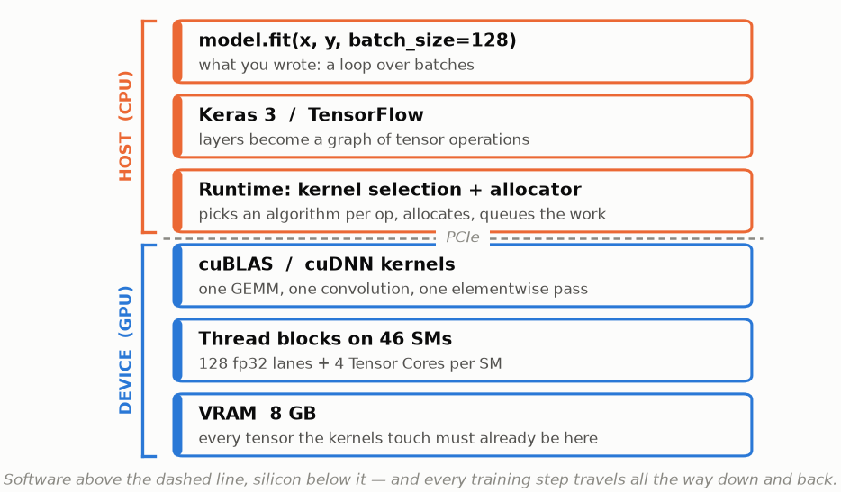
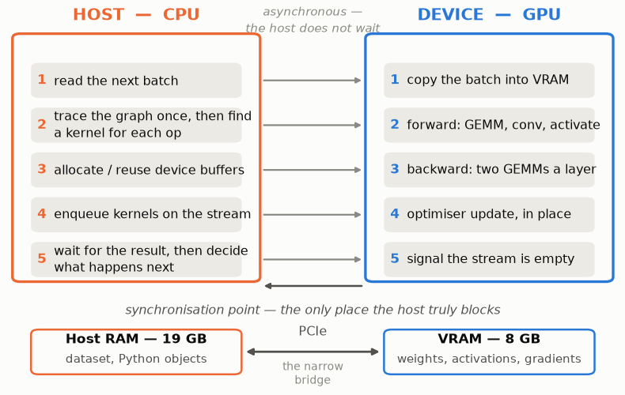
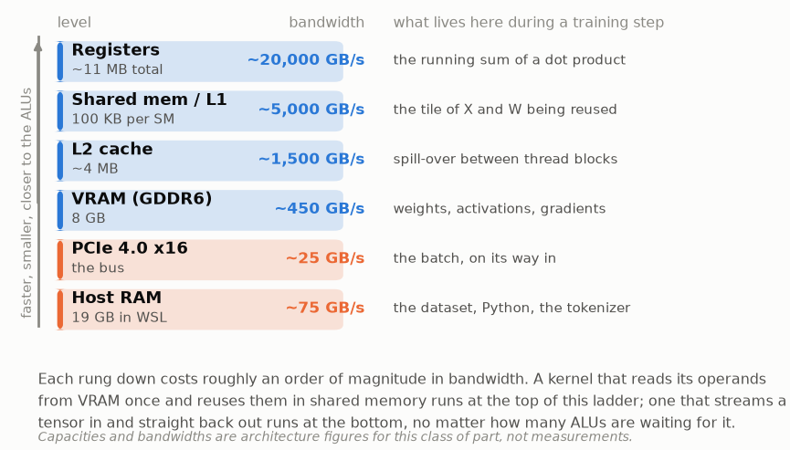
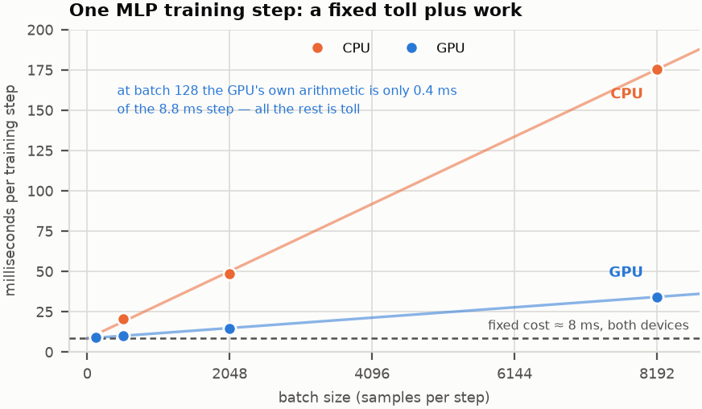
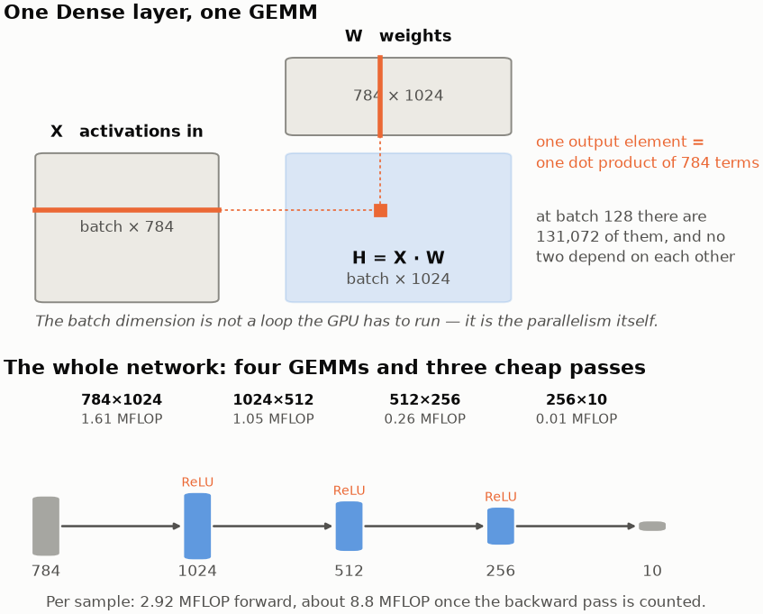
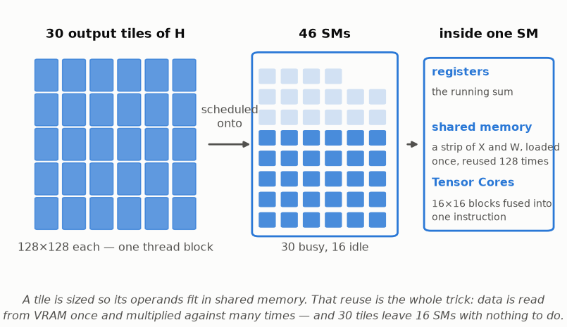
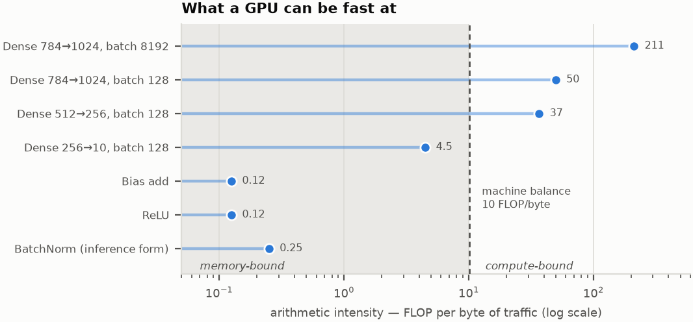
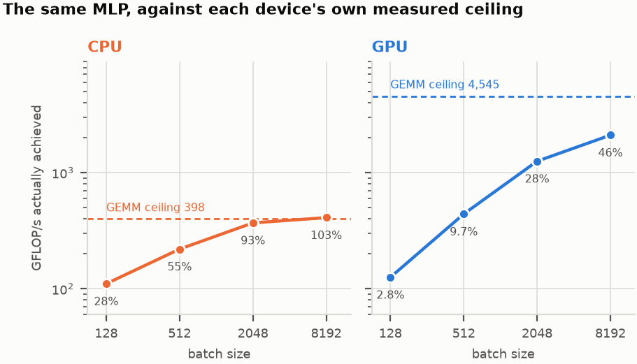

# What this document is for

Its companion, *CPU vs GPU untuk Beban Kerja AI*, measured what happens when the
same neural network is trained on a CPU and on a GPU. It answers the question
*what are the numbers*. This document answers the other one: *why are they
those numbers*.

The subject is a single machine — a laptop with an **NVIDIA GeForce RTX 3070 Ti Laptop GPU** and an
**Intel Core i9-12900H**, running TensorFlow 2.21.0 and Keras 3.15.1 under WSL2 —
and a single idea: that a neural network and the hardware underneath it are not
two separate topics that happen to meet at an API. They are the same object
described twice. A layer is a matrix multiply; a matrix multiply is a grid of
independent dot products; a grid of independent dot products is exactly the
shape of work a GPU was built to swallow. Every place that correspondence holds,
the hardware runs near its limit. Every place it breaks, performance falls off a
cliff — and the measurements in the companion report are a catalogue of both.

Every number quoted here is either measured on that machine or derived from
those measurements by arithmetic that is shown. Where a figure comes from the
architecture rather than the stopwatch, it says so.


{width=100%}


The picture above is the map for the rest of the document. Read it downward and
it is a call stack. Read it as a loop — down, then back up, sixty thousand
times per epoch — and it is a training run.

Part I follows the hardware: what the two chips are actually good at, how they
cooperate, and what the cooperation costs. Part II follows the software: what a
multilayer perceptron does, why that work is matrix multiplication, and why
matrix multiplication is the one operation this silicon executes near its peak.
Part III puts the two halves against each other and reads the measurements.


# Part I — The hardware

## Two chips that made opposite bets

A CPU and a GPU are both piles of transistors that multiply numbers. The
difference is what fraction of those transistors do the multiplying.


{width=100%}


A CPU core is built to make **one** instruction stream finish quickly. It
predicts branches, reorders instructions, speculates past cache misses, and
keeps tens of megabytes of cache nearby so that unpredictable memory access
patterns are survivable. All of that machinery is overhead in the strict sense:
it computes nothing. It exists so that the small number of ALUs are never idle
waiting for the next instruction to be decided.

A GPU makes the opposite bet. It assumes the work is **already known to be
parallel**, so it does not need to discover parallelism at runtime. One control
unit issues the same instruction to 32 lanes at once. There is no speculation,
no out-of-order execution, and comparatively little cache. What that buys is
lanes: 46 streaming multiprocessors, 5,888 fp32 lanes,
184 Tensor Cores. What it costs is that any work which is *not* already
parallel — a branch that diverges, a dependency chain, a small tensor — leaves
most of those lanes doing nothing.

The measured ceilings on this machine make the trade concrete. On a pure fp32
matrix multiply, the CPU reached **398 GFLOP/s** and the GPU
**4,545 GFLOP/s** — a factor of 11.4. That
number is the *best case*, the ceiling nothing else in the companion report
comes close to. Holding onto it is the entire engineering problem.

## The division of labour

The GPU is not a computer. It cannot read a file, run the Python interpreter,
decide when an epoch has ended, or decide which kernel to launch next. It is an
accelerator on the far side of a bus, and it does exactly what the CPU tells it
to, when the CPU tells it to.


{width=100%}


The important detail is step 4 and step 5. When the host enqueues a kernel, the
call **returns immediately**: the kernel has been placed on a stream, not run.
The host is free to enqueue the next one. This is what allows a slow, single-threaded
Python loop to drive a device with thousands of lanes — the host runs
ahead, building a queue the device eats through.

The moment that breaks is synchronisation. Anything that needs a *value* back
on the host — printing a loss, evaluating a metric, a Python `if` on a tensor —
forces the host to wait for the stream to drain. Keras does this once per step
by default (`steps_per_execution=1`). The companion report measures the cost of
that default directly: raising `steps_per_execution` to 32, so that thirty-two
steps are dispatched as one unit, took the GPU from
9,473 to 16,286 samples/s
(1.7x) with no change to the model, the data, or a single
hyperparameter.

That is a useful result on its own. It is a more useful one when you notice that
the same change also sped up the **CPU** run, from 10,638 to
12,890 samples/s. A device-synchronisation argument cannot
explain a speedup on the device that was never being synchronised with. What
both runs share is the Python-side dispatch loop — and on this machine that
loop has only 3 cores to run on.

## Memory is the hierarchy that matters

Arithmetic is not the scarce resource. Moving the operands to the arithmetic is.


{width=100%}


Two consequences of that ladder shape are worth stating plainly.

**The 8 GB at the VRAM rung is a hard wall, not a soft one.** A tensor a kernel
touches must be in VRAM. Not "should be" — must. Weights, activations kept for
the backward pass, gradients, and the optimiser's own state all live there
simultaneously, which is why memory use during training is several times the
size of the model. When it does not fit, nothing gets slower; the process dies.

**The PCIe rung is roughly twenty times narrower than the VRAM rung.** Anything
that crosses it during the step — a batch that was not prefetched, a metric
pulled back to Python, a `.numpy()` call in a callback — is paid for at the
slowest rate in the system. This is why the input pipeline is a performance
topic and not a plumbing detail, and why `.cache()` and
`.prefetch(tf.data.AUTOTUNE)` are load-bearing.

## What the handshake costs, measured

All of the above predicts a specific shape: every training step should carry a
**fixed cost** that does not depend on how much work the step contains, plus a
**marginal cost** proportional to the work. Fitting a straight line to the
measured step times confirms it, and does so unusually cleanly.


{width=100%}


The fit gives:

| Device | Fixed cost per step | Marginal cost per sample |
|---|---|---|
| CPU | 8.3 ms | 20.4 us |
| GPU | 8.4 ms | 3.1 us |


Two things stand out.

**The marginal costs differ by 6.5x.** This is the GPU
advantage, and it is the only place the GPU advantage lives. Each additional
sample costs the GPU 3.1 microseconds against the CPU's
20.4.

**The fixed costs are nearly identical — about 8.4 ms on
both.** If that toll were a device cost, it would not be the same on a device
that is not being used. Read together with the `steps_per_execution` result
above, the most economical explanation is that most of the per-step floor on
this machine is spent on the *host*: tracing, kernel lookup, allocator
bookkeeping, and the Python round trip, on 3 available cores. The GPU inherits
the CPU's dispatch bottleneck along with its own.

The arithmetic that follows is stark. At batch 128, the GPU's own work is
0.40 ms inside a 8.95 ms step: about
4% of the elapsed time is arithmetic and the rest is
toll. It takes a batch of roughly **2,669 samples** before the
computation is merely *equal* to the fixed cost. At batch 8192 the balance has
finally inverted — 25.7 ms of work inside a
34.2 ms step, or 75% arithmetic.

This is the mechanism behind the companion report's headline finding. A GPU is
not "faster". A GPU is a machine that charges a large entry fee and then sells
arithmetic cheaply. Whether that is a good deal depends entirely on how much
arithmetic you buy.


# Part II — The software

## A multilayer perceptron, written out

The network measured in the companion report is a plain MLP: an input of
784 features, then Dense layers of
1024, 512, 256 and 10 units, ReLU
between them, softmax at the end, 1,462,538 parameters. Nothing in it
is exotic, which is the point: it is the simplest thing that still exercises the
whole machine.

A single Dense layer is defined by

$$ H = f(X W + b) $$

and that is the whole story. $X$ holds the batch, one sample per row. $W$ holds
the weights. The product $XW$ is a matrix multiply — a **GEMM**, in the
vocabulary of the libraries that implement it. $b$ is a broadcast add, and $f$
is applied elementwise. Stack four of those and you have the network.


{width=100%}


Three properties of that picture are what make the operation suit a GPU, and it
is worth naming them separately because a great many operations in a neural
network have only one or two.

**Every output element is independent.** $H_{ij}$ depends on row $i$ of $X$
and column $j$ of $W$ and on nothing else — not on $H_{i,j-1}$, not on
anything computed earlier in the same layer. There is no dependency chain to
discover and no order to respect. At batch 128 the first layer produces
131,072 output elements that could, in principle, be computed in 131,072
different places at the same moment.

**Every element is computed the same way.** The same instruction sequence — a
chain of fused multiply-adds — produces all of them. Nothing branches on the
data. This is precisely the contract the GPU's shared control unit requires: one
instruction, many lanes, no divergence.

**Each operand is used many times.** Row $i$ of $X$ participates in every one of
the 1024 outputs of row $i$. Column $j$ of $W$ participates in every one of the
batch's rows. That reuse is what makes it possible to read data from slow memory
once and do a great deal of arithmetic on it — and, as the next two sections
show, it is the property that actually decides the outcome.

The batch dimension deserves one more sentence. It is easy to read `batch_size`
as a memory-management convenience — how many samples we can afford to hold at
once. On this hardware it is better read as the opposite: **the batch dimension
is where the parallelism comes from.** A batch of 1 gives the GPU a matrix-vector
product, which has almost no reuse and leaves most of 46 SMs empty. A
batch of 8192 gives it a large, square-ish GEMM. Same model, same code, two
completely different pieces of hardware being exercised.

## How a GEMM becomes 46 SMs of work

Knowing that a matrix multiply is parallel does not make it fast. The
implementation in cuBLAS has to arrange the work so that the memory hierarchy in
Part I is used the right way round.


{width=100%}


The output matrix is cut into tiles. Each tile is assigned to a thread block,
each thread block runs on one SM, and each thread accumulates a few output
elements in registers. The k-dimension is walked in strips: a strip of $X$ and a
strip of $W$ are loaded from VRAM into shared memory once, and then every thread
in the block multiplies against them repeatedly.

That last clause is where the performance comes from. A tile of 128x128 outputs
loads $2 \times 128 \times k$ operand values and performs
$2 \times 128 \times 128 \times k$ FLOPs on them: each value that crossed the
VRAM rung is used 128 times before it is discarded. Without the staging, the
same multiply would re-read its operands from VRAM for every FLOP and run at
memory speed — roughly two orders of magnitude slower — no matter how many lanes
were available.

The Tensor Cores sit one level below this. On this GPU (compute capability 8.6)
each SM has 4 of them, and each executes a small fixed-size
matrix multiply-accumulate as a single instruction rather than as a loop of
scalar FMAs. They are why `tf32` and `bf16` matter: those formats let the same
matrices go through the fast path. They are also why Tensor Core throughput is
so often unreachable in practice — feeding them requires the staging above to
keep up, and the memory hierarchy usually cannot.

## Arithmetic intensity: the number that decides everything

Both halves of this document now reduce to one ratio. For any operation, divide
the arithmetic it performs by the bytes it must move:

$$ I = \frac{\text{FLOPs}}{\text{bytes of memory traffic}} $$

The hardware has the same ratio: its peak arithmetic rate divided by its memory
bandwidth. On this GPU that is roughly 4,545 GFLOP/s over
~450 GB/s, or about **10 FLOP per byte**. An operation
above that number can be fed fast enough to keep the lanes busy; one below it
starves, and its speed is set by memory bandwidth alone — the ALU count is
irrelevant.


{width=100%}


The spread on that axis is three orders of magnitude, and it explains almost
every result in the companion report:

- The first Dense layer at batch 8192 sits at **211 FLOP/byte**,
  twenty times above the balance point. This is the regime the GPU was designed
  for.
- The same layer at batch 128 sits at **50** — still
  compute-bound, but with four times less headroom. The tiles are smaller, the
  reuse is lower, and fewer SMs have anything to do.
- The last Dense layer, 256 to 10, sits at **4.5**, below the
  line. It is a memory-bound operation regardless of batch size, because a
  10-column weight matrix simply does not offer enough reuse.
- ReLU, bias add, and normalisation sit at **0.1 to 0.3**. They read a tensor,
  do one or two arithmetic operations per element, and write it back. On this
  GPU they run about **eighty times** below the balance point. They are pure
  memory traffic wearing the costume of a computation.

## The layers between the GEMMs

That last bullet is not a footnote. A network is not only its matrix multiplies,
and the cheap-looking operations between them are exactly where GPU advantage
leaks away.

The companion report measures this on the CNN case. A separate profile of one
training step found that `BatchNormalization` alone accounted for roughly
**51 ms of the 90 ms** GPU step — a layer with a negligible FLOP count consuming
more than half the time. In Keras 3 on the TensorFlow backend it was not fused
into the cuDNN convolution kernel, so it became a sequence of small,
memory-bound passes, each paying its own launch cost, dispatched by a host with
3 cores.

The measured training results line up with that reading exactly:

| Model | Params | CPU s/epoch | GPU s/epoch | GPU speedup |
|---|---|---|---|---|
| MLP | 1.5M | 5.6 | 6.6 | 0.8x |
| CNN | 0.3M | 13.0 | 13.0 | 1.0x |
| Transformer | 8.3M | 55.0 | 13.7 | 4.0x |


The ordering is not about how "modern" each architecture is. It is about how
much arithmetic each one does per kernel launch. The transformer's attention and
feed-forward blocks are large GEMMs — it gains 4.0x. The MLP's
GEMMs are large too, but its steps are so short that the fixed cost from Part I
swallows the gain, and the GPU actually *loses*. The CNN sits between them and is
dragged down by its normalisation layers.

This is also the honest answer to why kernel fusion exists. `jit_compile=True`
(XLA) tries to merge chains of small operations into one kernel so that the
intermediate tensors never round-trip to VRAM. When it works, it converts a
column of memory-bound operations into one compute-bound one. When it does not —
and on the CNN measured here it did not, costing
32% of throughput — it is because XLA also replaced cuDNN's
tuned convolution algorithm with its own. Fusion is a real mechanism with real
limits, not a switch that makes things faster.


# Part III — Reading the measurements

## The same network against each device's own ceiling

The cleanest way to see the argument land is to stop comparing the two devices
to each other and compare each one to *itself*: to the fp32 GEMM ceiling
measured on that same chip, minutes apart, in the same session.

The MLP does 2.92 MFLOP of forward arithmetic per sample. The
backward pass costs about twice the forward pass — one GEMM for the input
gradient and one for the weight gradient per layer — so a training step is about
8.8 MFLOP per sample. Multiplying by batch size and dividing
by the measured step time gives the rate actually achieved:


{width=100%}


The result is the opposite of the intuition most people bring to this comparison.

**The CPU reaches essentially all of its ceiling.** At batch 8192 it computes at
409 GFLOP/s against a measured GEMM ceiling of
398 — around 103%, which is to say the MLP
training step runs as fast as the pure benchmark does. (Values slightly above
100% are run-to-run variation; the companion report documents roughly +/-30%
spread on absolute figures from thermal and clock behaviour.) The CPU has few
lanes, but it fills them.

**The GPU reaches 46% at its best and
2.8% at batch 128.** Everything in Parts I and II is visible
in that one number. The fixed dispatch cost is charged whether or not there is
work. The activations, the bias adds, and the softmax run at memory speed. The
last layer is too narrow to fill the machine. The batch dimension — the only
source of parallelism the GPU has — is too small to occupy 46 SMs.

The gap between 2.8% and 46% is not a
defect in the GPU. It is the distance between "an operation that is theoretically
parallel" and "an operation shaped so that this specific memory hierarchy can
feed this specific number of lanes." Closing that distance is what batch size,
`steps_per_execution`, mixed precision, and fusion all do. None of them changes
the model.

## What follows, in order of leverage

Every item below is a direct consequence of a mechanism above, applied to this
machine.

1. **Increase the batch until VRAM is nearly full.** It raises arithmetic
   intensity, fills more SMs, and amortises the 8.4 ms fixed
   cost across more samples. Nothing else on this list moves the number as far
   for as little effort.
2. **Set `steps_per_execution` to 32 in `model.compile`.** One argument, no
   effect on results, measured at 1.7x here. It attacks the
   host-side dispatch cost identified in Part I directly.
3. **Enable bf16 mixed precision.** Compute capability 8.6 has bf16 Tensor
   Cores, and bf16 carries the same exponent range as fp32, so no loss scaling
   is needed. On the transformer it gave 1.7x. The VRAM it frees
   is often worth more than the arithmetic, because that VRAM buys a larger
   batch, and item 1 is the bigger lever anyway.
4. **Feed the device.** With 3 cores, host-side loading and augmentation are a
   genuine bottleneck. `tf.data` with `.cache()` and
   `.prefetch(tf.data.AUTOTUNE)`, 2 to 4 workers.
5. **Then, and only then, try `jit_compile=True`.** Measure it. On the CNN
   measured here it cost 32% of throughput.

And the two rules that decide whether to reach for the GPU at all:

**Use the GPU** when the work per step is large — convolutions, attention, big
dense layers, long runs, batched inference over a corpus. Above the balance
point, the machine does what it says on the box.

**Use the CPU** when requests arrive one at a time with a latency target, for
classical models, for tokenisation and preprocessing, and for the first hours of
development when you only want to know whether the code runs. Moving a 200 MB
model into VRAM to classify one sentence is a net loss, and the measurements in
the companion report show it: at batch 1 the GPU's advantage on the CNN was
1.4x, against 3.1x at batch 64.

## One sentence

A neural network is a chain of matrix multiplications interrupted by cheap
elementwise work; a GPU is an enormous quantity of arithmetic behind a narrow
memory system and an expensive front door. Performance is whatever survives the
meeting of those two facts.


# Notes on the numbers

**Measured on this machine**, by `cpu_vs_gpu.py` with the `standard` preset,
each case in its own process, warm-up discarded, device synchronised before the
timer stops, medians rather than means: all GFLOP/s figures, all step times, all
samples/s figures, all speedups.

**Derived here**, by arithmetic shown in the text: the FLOP counts for the MLP,
the fixed and marginal costs from a least-squares fit to the four measured step
times per device, the achieved-throughput percentages, and the arithmetic
intensities.

**Architecture figures, not measured here**: 46 SMs,
5,888 fp32 lanes, 184 Tensor Cores, ~450 GB/s of VRAM
bandwidth, ~4 MB of L2, 100 KB of shared memory per SM, PCIe 4.0 x16 bandwidth,
and host DRAM bandwidth. These describe the class of part; they are used here
only to give the memory hierarchy a scale, and no conclusion in this document
depends on their precision.

**Not controlled**: this is a laptop. CPU and GPU clocks fall under thermal
load, and the companion report measures the effect at up to 30% on long runs and
more on short bursts. Ratios between CPU and GPU are far more stable than
absolute numbers, because both sides are measured under similar thermal
conditions.

To regenerate everything in this document:

```bash
python cpu_vs_gpu.py --preset standard --report results
python make_hardware_report.py
```
